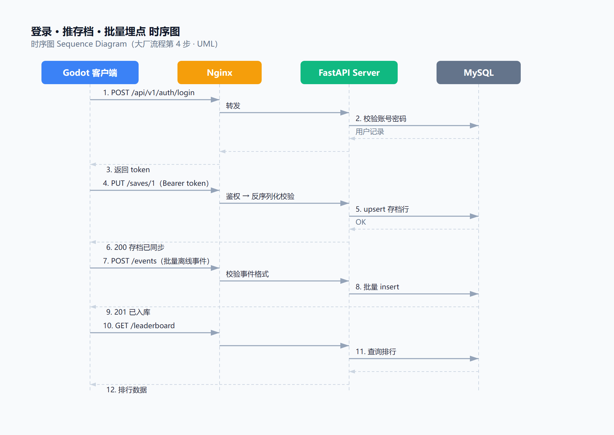
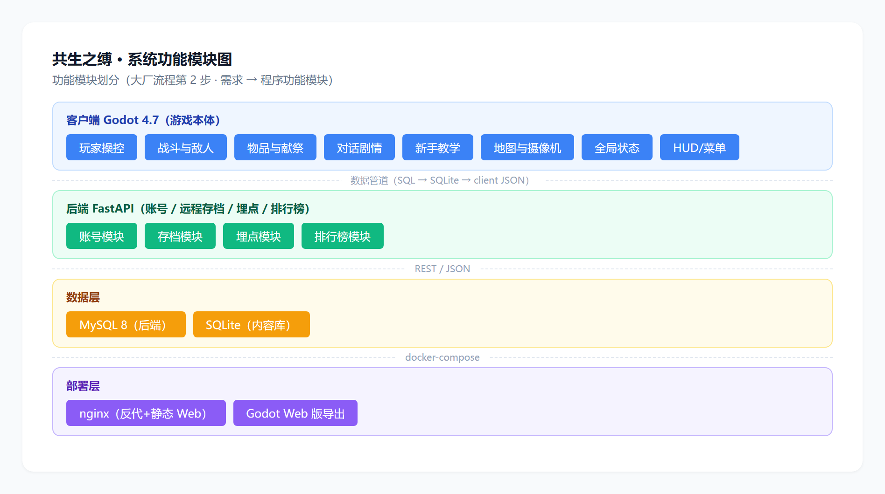
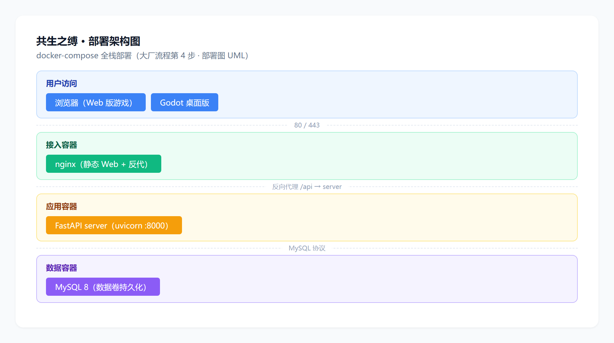
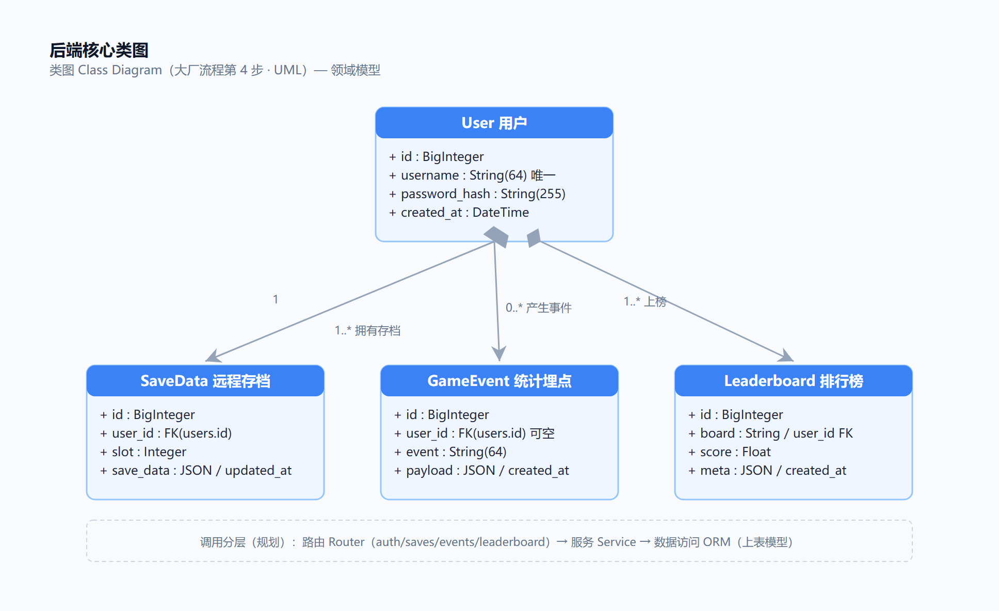
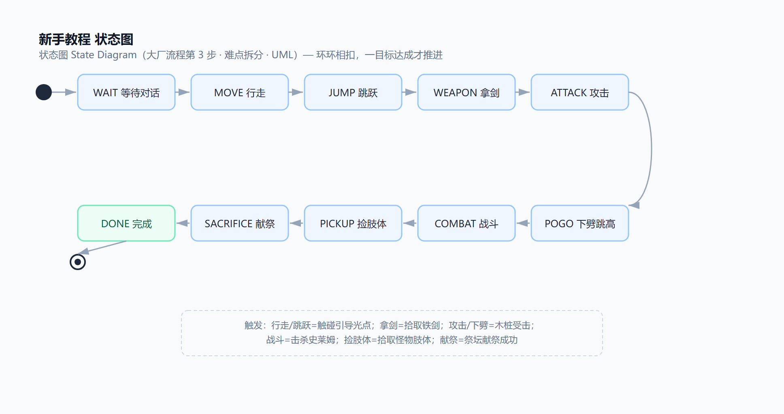
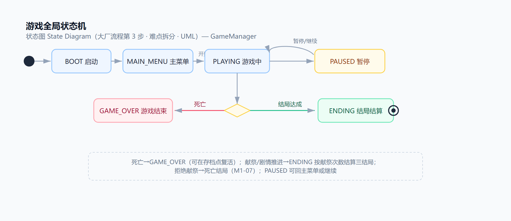

# 2组_共生之缚——横版动作探索游戏系统

## 项目概述

| 项 | 内容 |
|---|---|
| 项目名称 | 共生之缚（Symbiont）——横版动作探索游戏 |
| 玩法定位 | 玩家扮演骑士，在无魔法的深渊地牢猎杀怪物、拾取肢体，到祭坛献祭换力量；献祭越多，离人性越远 |
| 客户端 | Godot 4.7，纯 GDScript，GL Compatibility |
| 后端 | FastAPI + MySQL，REST 接口 |
| 部署 | docker compose 三容器（mysql8 + server + nginx）一键拉起 |
| 运行方式 | Windows 桌面 + 浏览器；单机为主，登录后可联网同步 |

## 用户角色

| 角色 | 说明 | 主要需求 |
|---|---|---|
| 游客 | 不注册直接玩 | 玩通教学关，本地存档 |
| 注册玩家 | 登录后使用 | 远程存档同步、统计上报 |
| 组员/维护者 | 管理数据、部署 | 改数据（SQL）、起服务（docker）、看后端探针 |

## 功能需求

### 客户端

| 功能 | 说明 | 状态 |
|---|---|---|
| 角色移动与操控 | 左右移动、跳跃（固定跳高 3.7 倍身高）、攻击、下劈反弹 | 已完成 |
| 新手教学 | 气泡提示、引导光点、分区教学、武器剧情 | 已完成 |
| 敌人 | 巡逻史莱姆：巡逻、追击、接触伤害、掉肢体 | 已完成 |
| 对话与剧情 | 寄生体低语、打字机效果、对话时锁输入 | 已完成 |
| 物品与献祭 | 肢体拾取计数、祭坛献祭计数 | 已完成 |
| 摄像机 | 水平跟随 + 垂直死区 | 已完成 |
| 任务光点组件 | 引导光点，其他关卡可复用 | 已完成 |
| 教学关卡 | 平台、下劈高台、浅坑、祭坛 | 已完成 |
| 存档/读档 | 本地 JSON，退出后能接着玩 | 待实现（M1） |
| 主菜单 + HUD | 开始/继续/设置，显示血量和献祭数 | 待实现（M1） |
| 拒绝献祭结局 | 玩家拒绝献祭，触发"宁死不屈"死亡结局 | 待实现（M1） |
| 战斗扩展 | 钩锁、二段跳/大跳、武器成长、更多敌人 | 待实现（M2） |
| 完整地图 | 三层地牢、阵营分支 | 待实现（M3） |
| 三结局结算 | 人类/异化/真 HE | 待实现（M3） |

### 后端

| 功能 | 说明 | 状态 |
|---|---|---|
| 健康探针 | GET /api/v1/health | 已完成 |
| 账号 | 注册/登录/token | 待实现（M2） |
| 远程存档 | GET/PUT /api/v1/saves/{slot} | 待实现（M2） |
| 统计埋点 | POST /api/v1/events | 待实现（M2） |
| 排行榜 | GET /api/v1/leaderboard | 待实现（M2） |

### 数据与部署

| 功能 | 说明 | 状态 |
|---|---|---|
| 数据管道 | SQL → SQLite → JSON，运行时加载 | 已完成 |
| docker 全栈 | mysql8 + server + nginx 一键拉起 | 待实现（M2） |
| Web 导出 | 浏览器可玩 | 待实现（M2） |
| 数据看板 | 玩家数、事件、结局分布 | 有余力再做 |

## 需求建模

### 用例图

参与者是玩家（游客/账号）和组员。客户端有开始游戏与教学、移动/跳跃/攻击/下劈、拾取肢体与祭坛献祭、本地存档/读档；后端有注册/登录、远程存档同步、统计埋点上报、排行榜。账号玩家是游客的扩展：游客能做的都能做，另外多了联网功能。

### 时序图

这张图画的是登录后依次发生的事：登录、推存档、上报统计、查排行榜。

### 完整功能架构图

系统分九个模块（图里标 A 到 I）：玩家操控、战斗与敌人、物品献祭成长、对话剧情、教程引导、地图摄像机、全局状态、数据管道、后端。

### 功能架构子图

后端子图（组件分层、部署拓扑、类结构）：

行为子图（存档流程、教程状态、游戏状态）：

## 非功能需求

| 类别 | 要求 |
|---|---|
| 性能 | 稳定 60FPS，GL Compatibility，资源占用低 |
| 可玩性 | 无致命 bug，教学关 5 分钟内通关，手感参数可调 |
| 兼容性 | Windows + 浏览器，都用 Godot 4.7 |
| 网络 | 单机优先，没网也能玩，联网后补报数据 |
| 数据 | 内容数据由 SQL 导出，存档按 Schema v1 |
| 安全 | 密码哈希存储，接口用 token 鉴权 |
| 质量 | CI 三个 job 全绿，PR 需 review，main 受保护 |

## 验收标准

- 三层地牢、双流派、三结局都能玩，存档可用，没有致命 bug；
- 后端 FastAPI + MySQL，OpenAPI 文档齐全，pytest 全绿，数据真实入库；
- docker compose 一键拉起，浏览器能打开游戏；
- 课程文档、数据库脚本、周报齐全；
- CI 全绿、main 保护、README 完整。
