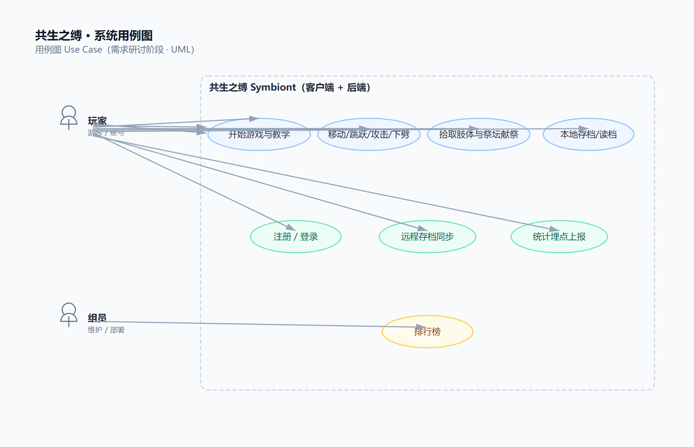

# 03 需求研讨与用例

- 课程：软件工程｜组号：2 组｜项目：共生之缚 Symbiont（类恶魔城 2D 游戏）
- 文档：课堂作业 2 · 大厂流程第 1 步 需求研讨｜UML：用例图
- 说明：本文档自包含，全部内容在本文件夹内（配套图见 `uml/`）。

## 一、需求研讨：做什么、怎么做

**目的**：阅读产品/设计文档，把"想法"翻译成"明确需求"，避免开发时理解偏差。
**做法**（对应大厂流程第 1 步）：
1. 通读产品文档：游戏设计 GDD（世界观/剧情/系统）、需求分析（见本文件夹 `01-需求分析文档.md`）；
2. 逐条确认需求的可实现性、优先级、验收口径；
3. 列出"已确认"与"待拍板"项，标注负责人；
4. 用**用例图**表达"谁（角色）能做什么（功能）"。

本项目需求来源 = 游戏设计定稿 + 需求分析文档，**没有歧义的直接确认**，有歧义的列入"待拍板"。

## 二、完整需求清单（已确认/规划）

### 2.1 客户端（游戏本体，Godot 4.7）

| 编号 | 需求 | 说明 | 状态 |
|---|---|---|---|
| F-01 | 角色移动与操控 | 左右移动、跳跃（固定跳高=3.7 倍身高）、攻击、下劈（可踩实体反弹） | ✅ 已实现 |
| F-02 | 新手教学 | 头顶气泡提示、单个白色引导光点（触碰后飞向下一个目标）、分区环环相扣教学、武器剧情 | ✅ 已实现 |
| F-03 | 敌人 | 巡逻史莱姆（巡逻/追击/接触伤害/死亡掉肢体） | ✅ 已实现 |
| F-04 | 对话与剧情 | 寄生体低语（打字机/K 键逐条/链式台词）、对话锁输入 | ✅ 已实现 |
| F-05 | 物品与献祭 | 怪物肢体拾取（计数）、祭坛献祭（计数+1） | ✅ 已实现 |
| F-06 | 摄像机 | 水平跟随 + 垂直死区、15 倍角色身高视野 | ✅ 已实现 |
| F-07 | 任务光点组件 | 通用引导光点（悬浮/触碰触发/飞到下一目标，供后续任务复用） | ✅ 已实现 |
| F-08 | 教学关卡 | 平台/下劈跳高/浅坑地形/祭坛，教学全流程 | ✅ 已实现 |
| F-09 | 存档/读档 | 本地 JSON 存档、恢复玩家状态 | ⏳ 待实现（M1） |
| F-10 | 主菜单 + HUD | 开始/继续/设置、血量/献祭计数显示 | ⏳ 待实现（M1） |
| F-11 | 拒绝献祭结局 | "宁死不屈"死亡结局 | ⏳ 待实现（M1） |
| F-12 | 战斗扩展 | 钩锁、二段跳/大跳、武器成长、更多敌人、小 Boss | ⏳ 待实现（M2） |
| F-13 | 完整地图 | 三层固定地牢地图、阵营分支（异教徒/工程师） | ⏳ 待实现（M3） |
| F-14 | 三结局结算 | 人类 / 异化 / 真 HE | ⏳ 待实现（M3） |

### 2.2 后端（FastAPI + MySQL）

| 编号 | 需求 | 说明 | 状态 |
|---|---|---|---|
| F-15 | 健康探针 | GET /api/v1/health | ✅ 已实现 |
| F-16 | 账号 | 注册/登录/token | ⏳ 待实现（M2） |
| F-17 | 远程存档 | GET/PUT /api/v1/saves/{slot} | ⏳ 待实现（M2） |
| F-18 | 统计埋点 | POST /api/v1/events | ⏳ 待实现（M2） |
| F-19 | 排行榜 | GET /api/v1/leaderboard | ⏳ 待实现（M2） |

### 2.3 数据与部署

| 编号 | 需求 | 说明 | 状态 |
|---|---|---|---|
| F-20 | 数据管道 | SQL → SQLite → client JSON（运行时加载） | ✅ 已实现 |
| F-21 | docker 全栈 | mysql8 + server + nginx 一键拉起 | ⏳ 待实现（M2） |
| F-22 | Web 导出 | Godot 导出 Web 版，浏览器可玩 | ⏳ 待实现（M2） |
| F-23 | 数据看板（stretch） | 玩家数/事件/结局分布 | ⏳ 有余力再做 |

## 三、需求确认状态

| 需求 | 确认状态 | 待拍板问题 |
|---|---|---|
| 移动/攻击/下劈/教学/献祭等 M1 已实现项 | ✅ 已确认（已验收） | — |
| 存档/主菜单/拒绝结局（M1） | ✅ 方向确认 | 存档槽位数、是否自动存档 |
| 双流派数值（钩锁 vs 大跳、献祭 vs 探索） | ⏳ 待拍板 | GDD 待决策：双流派数值基线 |
| 三结局条件 | ⏳ 待拍板 | 献祭次数阈值（==1 人类 / >1 异化 / HE 特殊道具）；"拒绝即死"是否计入通关统计 |
| HE 特殊道具与人线更好结局关系 | ⏳ 待拍板 | 人线道具是否达成更好结局 |
| 三层地图规模与连通方式 | ⏳ 待拍板 | 回起点引导怎么做 |
| 存档同步策略（自动/手动） | ⏳ 待拍板 | 远程存档冲突处理 |

> 待拍板项不阻塞当前开发（M1 剩余任务不依赖），进入 M2/M3 前由 2 组拍板。

## 四、用例图

**图说明**：
- 参与者：**玩家**（游客/账号）、**组员**（维护/部署）。
- 客户端用例：开始游戏与教学、移动/跳跃/攻击/下劈、拾取肢体与祭坛献祭、本地存档/读档。
- 后端用例：注册/登录、远程存档同步、统计埋点上报、排行榜。
- 边界框 = 系统（客户端 + 后端）对外提供的全部功能；组员用例 = 部署与后端查看。

## 五、本节结论

- 需求研讨完成：23 项需求全部明确（已实现 8 项客户端 + 1 项后端 + 1 项数据；待实现 13 项），待拍板 6 项不影响 M1 收尾；
- 用例图表达"谁做什么"，为第 2 步功能划分提供输入。
