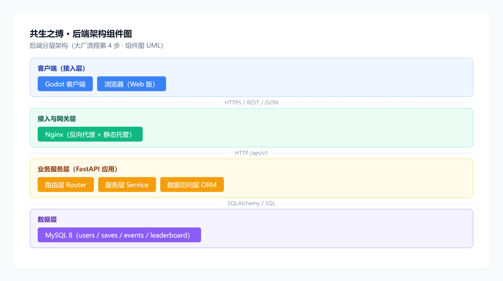

# 06 后台架构设计

- 课程：软件工程｜组号：2 组｜项目：共生之缚 Symbiont
- 文档：课堂作业 2 · 大厂流程第 4 步 画后台架构图｜UML：组件图 / 部署图 / 类图 / 时序图
- 说明：本文档自包含，全部内容在本文件夹内（配套图见 `uml/`）。

## 一、后台架构设计：做什么、怎么做

**目的**：面向后台核心服务，设计技术/功能架构（对应大厂流程第 4 步）。
**做法**：
1. 明确后端职责：账号、远程存档、统计埋点、排行榜，服务客户端（Godot/Web）；
2. 设计分层：接入（nginx）→ 业务（FastAPI：路由/服务/数据访问）→ 数据（MySQL）；
3. 用 UML 组件图/部署图/类图/时序图表达结构、部署、模型与关键交互。

## 二、后端定位与分层

- **定位**：轻量后端，支持"单机为主、联网可选"——客户端离线优先，联网后同步。
- **分层**：
  1. **接入层**：Nginx 反向代理（`/api` → server）、托管 Web 版静态资源；
  2. **业务层**：FastAPI 应用，三层划分——路由 Router（接收请求/校验）→ 服务 Service（业务规则）→ 数据访问 ORM（SQLAlchemy）；
  3. **数据层**：MySQL 8（四个表：users / saves / events / leaderboard）。
- 客户端通过 REST/JSON 调用，接口定义见第三节。

## 三、REST 接口清单

| 方法 | 路径 | 说明 | 鉴权 | 状态 |
|---|---|---|---|---|
| GET | /api/v1/health | 健康探针 | 无 | ✅ 已实现 |
| POST | /api/v1/auth/register | 注册（用户名+密码） | 无 | ⏳ M2 |
| POST | /api/v1/auth/login | 登录，返回 token | 无 | ⏳ M2 |
| GET | /api/v1/saves/{slot} | 拉取远程存档（JSON） | Bearer token | ⏳ M2 |
| PUT | /api/v1/saves/{slot} | 推送远程存档 | Bearer token | ⏳ M2 |
| POST | /api/v1/events | 批量统计埋点 | Bearer token（可空） | ⏳ M2 |
| GET | /api/v1/leaderboard | 排行榜 | 无 | ⏳ M2 |

> 错误码：FastAPI 默认 `{"detail": "..."}`；鉴权：`Authorization: Bearer <token>`；WebSocket 不做（单机无实时需求）。

## 四、数据表设计（MySQL）

| 表 | 字段（核心） | 说明 |
|---|---|---|
| users | id PK、username 唯一、password_hash、created_at | 账号 |
| saves | id PK、user_id FK→users、slot、save_data JSON、updated_at | 远程存档（每用户每槽一条） |
| events | id PK、user_id FK（可空）、event、payload JSON、created_at | 统计埋点 |
| leaderboard | id PK、board、user_id FK→users、score、meta JSON、created_at | 排行榜条目 |

> 与存档 Schema v1 对齐：`{version, saved_at, game_progress{sacrifice_count, current_floor, faction, flags}, player, inventory, levels}`。

## 五、部署设计（docker-compose 三容器）

| 容器 | 镜像 | 职责 |
|---|---|---|
| mysql8 | mysql:8 | 数据持久化（数据卷） |
| server | Dockerfile.server | FastAPI + uvicorn :8000 |
| nginx | Dockerfile.game-web + nginx.conf | 托管 Godot Web 版 + 反代 /api |

`docker compose up -d` 一键拉起，浏览器访问 Web 版游戏，游戏内网络层调用后端接口。

## 六、UML 图

### 6.1 后端组件图

**说明**：Godot 客户端/浏览器 → Nginx → FastAPI（路由/服务/ORM 三层）→ MySQL；分层明确，接口边界清晰。

### 6.2 部署图

**说明**：浏览器/桌面客户端 → nginx 容器 → FastAPI 容器 → MySQL 容器，对应 docker-compose 三容器与端口（80 / 8000 / 3306）。

### 6.3 后端核心类图

**说明**：四个领域模型（User / SaveData / GameEvent / Leaderboard），User 与另外三者是 1 对多关联；底部注明规划中的 Router → Service → ORM 调用分层。

### 6.4 登录 · 推存档 · 批量埋点 时序图

**说明**：完整链路：客户端登录拿 token → 带 token 推存档（鉴权 + upsert）→ 批量上报离线埋点 → 查询排行榜；虚线为返回/结果。

## 七、本节结论

后台架构设计完成：分层明确、接口与数据表对齐、部署拓扑清晰；四张 UML 图（组件/部署/类/时序）可直接指导 M2 后端实现与测试用例编写。
