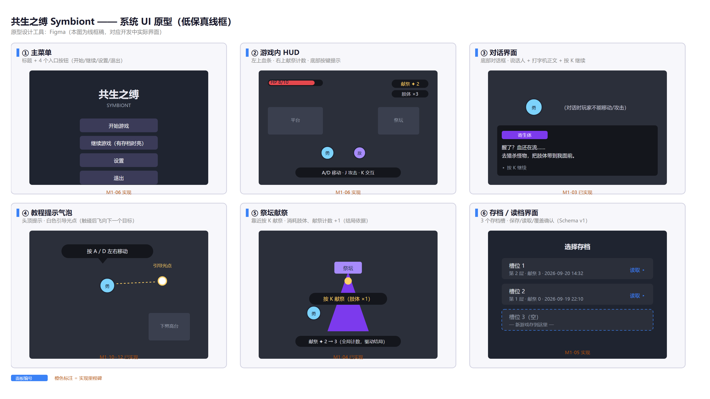

# 08 原型设计

- 课程：软件工程｜组号：2 组｜项目：共生之缚 Symbiont
- 文档：课堂作业 2 · 设计原型（原型设计工具）
- 说明：本文档自包含，全部内容在本文件夹内（配套图见 `uml/`）。

## 一、原型设计工具选型

**用什么工具**：Figma（主）、Axure RP（备）。

| 工具 | 定位 | 我们用在哪 |
|---|---|---|
| Figma | 在线低保真/高保真原型，多人实时协作 | 主菜单/HUD/对话/存档等界面线框，组内共享评审 |
| Axure RP | 交互细节、条件分支、变量 | 需要演示交互流程（存档读档、献祭计数联动）时用 |
| 游戏内直接调 | Godot 编辑器 | 交互反馈（手感、粒子、演出）以实际游戏为准，原型只定布局 |

**流程**：先 Figma 画线框定布局 → 组内评审 → 开发按线框实现 → 游戏内实际效果为准（原型不做手感）。

## 二、系统 UI 原型总览

**原型覆盖 6 个界面**，对应开发里程碑：

| 界面 | 关键内容 | 对应功能点 | 状态 |
|---|---|---|---|
| ① 主菜单 | 标题 + 开始/继续/设置/退出（有存档时"继续"亮起） | G-05 | ⏳ M1 |
| ② 游戏内 HUD | 左上血条 · 右上献祭计数/肢体数 · 底部按键提示 | G-05 | ⏳ M1 |
| ③ 对话界面 | 底部对话框：说话人 + 打字机正文 + 按 K 继续；对话锁输入 | D-01/D-02 | ✅ M1 |
| ④ 教程气泡 | 头顶提示气泡 + 白色引导光点（触碰后飞向下一目标） | E-02/E-03 | ✅ M1 |
| ⑤ 祭坛献祭 | 靠近按 K 献祭，消耗肢体、全局献祭计数 +1（结局依据） | C-02/C-03 | ✅ M1 |
| ⑥ 存档界面 | 3 个存档槽：楼层/献祭数/时间，读取与覆盖确认 | G-04 | ⏳ M1 |

**原型与数据项的关系**：每个界面显示的字段都来自 07 文档的数据项清单（如 HUD 的"献祭 ✦ 2"= game_progress.sacrifice_count；存档槽的"第 2 层 · 献祭 3"= current_floor + sacrifice_count + saved_at）。原型只负责"摆在哪"，数据负责"显示什么"，两边对得上才是完整的。

## 三、关键交互流程（原型里要演示的）

1. **主菜单 → 游戏**：点"开始游戏"（或"继续游戏"读档）→ 进入游戏场景；
2. **游戏内**：HUD 随状态实时更新（血量/献祭数/肢体数）；
3. **对话**：触发对话 → 锁输入 → 打字机逐条 → 按 K 跳过/继续 → 解锁输入；
4. **献祭**：靠近祭坛提示"按 K 献祭" → 消耗肢体、计数 +1 → HUD 与结局依据更新；
5. **存档/读档**：存档界面选槽位 → 保存/读取/覆盖确认 → 返回游戏。

## 四、本节结论

原型设计完成：选定 Figma（主）+ Axure（备），输出 6 界面线框总览图；原型布局与 07 数据项清单一一对应，为 M1（存档）/M1（主菜单+HUD）的实现提供界面基准。
