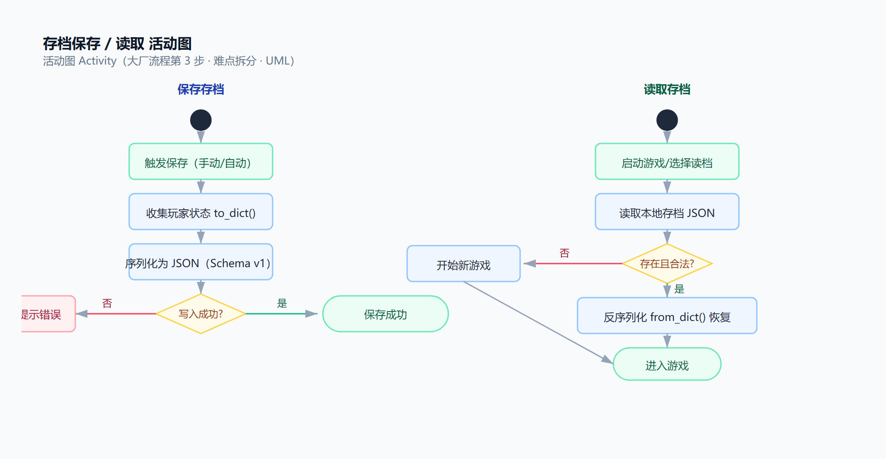

# 09 技术难点与解决方案

- 课程：软件工程｜组号：2 组｜项目：共生之缚 Symbiont
- 文档：课堂作业 2 · 技术难点 ≥ 小组人数（6 人）+ 解决技术方案与实现方案
- 说明：本文档自包含（原"05 难点拆分与工作量"已并入本文，不另设文件）；难点共 14 个（≥ 6 人小组下限），前 5 个已在 main 验收，其余 9 个已给出落地路径。

## 一、客户端难点（已实现并验收的 5 个）

### 难点 1：下劈跳高物理（已解决）
- 关联功能：F-01 角色移动与操控｜A-04 下劈（pogo）
- 难点：下落中按 J、踩实体反弹、多段连跳；下落速度快（vy=700），实体碰撞信号 `body_entered` 会漏判，手感不可靠。
- 解决技术方案：放弃"等碰撞信号"，改成每帧主动空间查询——用 `PhysicsShapeQueryParameters2D` 在玩家下落路径前方做 64×80 矩形查询，查到可踩实体即起跳。
- 实现方案：`player.gd` 里每帧调用 `_query_pogo_target()`，查询区域中心 = 玩家位置 + 攻击方向偏移；命中实体就反弹起跳、重置跳跃段数。配合开场对话 `_input_locked` 的解锁时机，用无头测试（等 0.6s 后发对话结束事件）全链路验证。

### 难点 2：新手教程状态机（已解决）
- 关联功能：F-02 新手教学｜E-01 教程状态机
- 难点：移动→跳跃→拿剑→攻击→下劈→战斗→献祭 多个教学环节环环相扣，顺序乱了教学就废；目标没轮到就被提前触发。
- 解决技术方案：事件驱动 + 每帧目标检测 + 软隔离。每个环节一个状态，由"目标达成"事件推进；未轮到的实体（木桩/史莱姆/祭坛）在"软隔离"期不响应玩家。
- 实现方案：`tutorial.gd` 状态机监听 EventBus 事件 + 每帧检测玩家位置；各实体（`dummy_target.gd`、`slime.gd`、`altar.gd`）实现激活门控。无头测试覆盖从"醒来"到"献祭完成"全链路，保证不卡死、不跳环。

### 难点 3：引导光点（已解决）
- 关联功能：F-07 任务光点组件｜E-03 引导光点
- 难点：单个白色光点触碰后要飞向下一个目标、循环引导；飞行途中可能被误触、或没到目标就触发下一步。
- 解决技术方案：光点有"待机/飞行"两个状态，飞行中关闭触碰判定；到达目标后用 tween（1.1s、SINE 缓动）移动到下一目标再开启。
- 实现方案：`quest_marker.gd` 的 `move_to()` 用 `create_tween()` 做平滑移动，移动完成才重置触碰；组件参数化（目标坐标、时长），供后续任务复用。

### 难点 4：摄像机死区（已解决）
- 关联功能：F-06 摄像机｜F-01 摄像机跟随
- 难点：水平跟随 + 垂直死区，爬升场景里画面乱晃、让人头晕。
- 解决技术方案：水平方向平滑插值（lerp）跟随，垂直方向设死区（角色在死区内不动镜头），镜头位置加限幅 clamp。
- 实现方案：`camera_follow.gd` 分轴处理：x 轴 lerp，y 轴只在超出死区时跟随；镜头位置 clamp 到地图范围，避免出界。

### 难点 5：手感调优（跳跃/攻击/下劈反弹）（已解决）
- 关联功能：F-01 操控｜D6
- 难点：跳高、判定框、后摇、反弹高度全是"手感玄学"，纯靠试。
- 解决技术方案：所有手感参数常量集中管理（跳高=3.7×身高、土狼时间、跳缓冲、下劈反弹速度等），参数化后逐个调、逐个试玩。
- 实现方案：常量定义在 `player.gd` 顶部，调整只改常量不碰逻辑；每次调整由组长 F5 试玩验收，验收通过才算完。

## 二、客户端难点（未实现，已给出方案）

### 难点 6：存档 / 读档恢复
- 关联功能：F-09 存档/读档｜G-04 SaveSystem
- 难点：玩家/全局状态序列化与恢复；版本迁移；恢复不完整（存了读不出来、读了缺字段）。
- 解决技术方案：统一存档 Schema v1（`{version, saved_at, game_progress{...}, player, inventory, levels}`），对象各自实现 `to_dict()/from_dict()`；缺字段给默认值，version 用于将来迁移。
- 实现方案：`save_system.gd` 保存 = 收集各系统 to_dict → 写 `user://saves/slot_N.json`；读取 = 读 JSON → 校验 → from_dict 恢复，失败则开始新游戏。`game_manager.gd` 的 to_dict/from_dict 已备好，按 M1 实现并写恢复测试。

### 难点 7：主菜单 + HUD
- 关联功能：F-10 主菜单 + HUD｜G-05
- 难点：主菜单（开始/继续/设置）+ 游戏内 HUD（血量/献祭计数/肢体数）联动游戏状态机。
- 解决技术方案：HUD 数据全部来自 GameManager/玩家状态，用信号（EventBus）驱动刷新；主菜单"继续游戏"按 `has_save()` 亮起。
- 实现方案：按 08 原型图实现界面；HUD 监听血量/献祭/肢体变化信号刷新标签，M1 完成。

### 难点 8：拒绝献祭结局
- 关联功能：F-11 结局系统｜G-06
- 难点：教学关里玩家拒绝献祭要触发"宁死不屈"死亡结局，且不影响后续玩法分支。
- 解决技术方案：拒绝事件 → 触发 `refuse_die` 结局对话（数据在 dialogues 表，branch=ending:refuse_die）→ 进入 GAME_OVER 结算。
- 实现方案：对话系统 next_id 链末尾接结局分支；结局触发后 GameManager 状态切到 GAME_OVER，M1 完成。

## 三、后端难点（未实现，已给出方案）

### 难点 9：token 鉴权（注册/登录）
- 关联功能：F-16 账号｜I-02
- 难点：密码不能明文存；token 要能校验、要防伪造。
- 解决技术方案：密码用成熟哈希库（passlib/bcrypt）加盐存储；token 用 JWT（python-jose）签发与校验，有效期设合理时长。
- 实现方案：`POST /auth/register`（用户名+密码哈希入库）→ `POST /auth/login`（校验后发 JWT）；写 pytest 覆盖注册重复名、错误密码、无效 token 等用例。

### 难点 10：远程存档同步
- 关联功能：F-17 远程存档｜I-03
- 难点：客户端本地存档 ↔ 服务器 saves 表；多端/离线冲突。
- 解决技术方案：以"最后写入时间"为准（last-write-wins）；存档内容就是 Schema v1 的 JSON，客户端本地档与远程档格式对齐。
- 实现方案：`GET/PUT /api/v1/saves/{slot}`，PUT 时 upsert（存在则更新，不存在则插入）并刷新 updated_at；客户端保存时 `Network.push_save` 异步同步，离线自动忽略。

### 难点 11：批量统计埋点
- 关联功能：F-18 统计埋点｜I-04
- 难点：游戏事件很多、可能离线攒一堆，逐条上报浪费、还怕丢。
- 解决技术方案：客户端离线事件队列攒批 → `POST /events` 一次批量入库；幂等去重（事件自带 id，重复的不再记）。
- 实现方案：客户端 EventBus 统一 `log_event` 入队，联网后批量 POST；后端按事件 id 去重，pytest 覆盖批量/重复用例。

### 难点 12：排行榜
- 关联功能：F-19 排行榜｜I-05
- 难点：查询要排序、要快。
- 解决技术方案：leaderboard 表 + SQL 排序；board 字段区分榜单（如速度通关榜），按需加索引。
- 实现方案：`GET /api/v1/leaderboard` 按 score 降序返回前 N 条；M2 实现并测试。

## 四、部署难点（未实现，已给出方案）

### 难点 13：docker 全栈一键拉起
- 关联功能：F-21 docker 全栈｜I-07
- 难点：mysql8 + server + nginx 三个容器要协同、网络要通、首次构建易踩坑。
- 解决技术方案：docker-compose 编排三容器（mysql8 数据库 / FastAPI 后端 / nginx），nginx 反代 /api 到后端、托管 Web 版游戏静态资源；数据卷持久化 MySQL。
- 实现方案：按 `deploy/` 配置先本地 `docker compose up -d` 逐容器验证，再进 CI；nginx 加健康检查。

### 难点 14：Godot Web 导出
- 关联功能：F-22 Web 导出｜D12
- 难点：Godot 导出 Web 版 + nginx 托管，跨平台兼容、CORS、加载慢。
- 解决技术方案：GL Compatibility 渲染（已选）降低兼容成本；nginx 正确配 MIME、gzip；尽早试导出暴露问题。
- 实现方案：Godot 导出预设 Web → 产物放 nginx 静态目录 → 浏览器验证可玩；网络层调用后端接口用相对路径经 nginx 反代，避免 CORS。

## 五、工作量汇总（原 05 并入）

| 范围 | 难点数 | 总故事点 | 折算人日（1 点≈0.5 人日） |
|---|---|---|---|
| 客户端 | 8 | 22+ | 11+ |
| 后端 | 4 | 12 | 6 |
| 部署 | 2 | 7 | 3.5 |
| **合计** | **14** | **41+** | **约 20.5+ 人日** |

> 已解决难点（下劈物理/教程/光点/摄像机）不计入剩余工作量；剩余难点集中在 M1（存档/HUD/结局）+ M2（后端 + 钩锁改造）。

## 六、关键流程与状态机图

### 6.1 存档保存/读取活动图（难点 6）

**说明**：保存 = 收集状态 → 序列化 JSON → 写本地；读取 = 读 JSON → 校验 → 反序列化恢复，失败则开始新游戏。这是存档功能的核心流程，活动图可指导实现。

### 6.2 新手教程状态图（难点 2）

**说明**：10 个状态（含等待对话与完成），每个状态由"目标达成"事件推进（触碰光点/拾取/受击/击杀/献祭），软隔离保证不会跳环。

### 6.3 游戏全局状态机（难点 4 关联 / 结局前置）

**说明**：BOOT → 主菜单 → 游戏中（可暂停）→ 结局结算 / 游戏结束；死亡可重生（存档点），结局按献祭次数结算——为结局系统打基础。

## 七、结论

技术难点共 14 个（远超 6 人小组人数下限），覆盖客户端/后端/部署；前 5 个已实现验收，证明"小步验收 + 无头测试"的方法可行；其余 9 个都已给出解决技术方案与实现方案，M1/M2/M3 按此推进。
